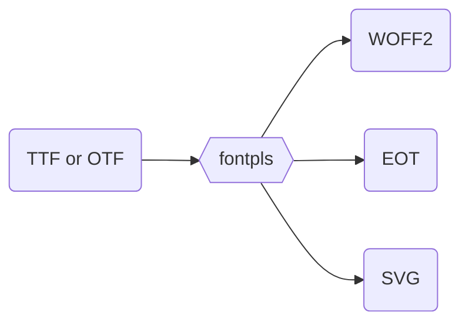

# `fontpls`

A typeface conversion tool for making webfonts, accessible via most CLIs

## Usage

#### `fontpls /path/to/file.otf`

The above command should be run in the CLI. The input (`$1`) value must be a `.otf` or `.ttf` file.

If successful, the new font files (`.svg`, `.eot`, `.woff2`) will be written to the same directory that the original TrueType or OpenType font was in.

## Local development

This project hasn't yet been released via a package manager like `npm` yet. So to get started with local development, and to use the tool, follow these steps:

1. Clone this repository
2. Navigate to the root of this repo on your local machine and run `npm link`
3. Run the command! e.g., `fontpls ~/Desktop/helvetica.otf`

Note that `npm link` will now maintain the symbollic link to the package, so updates made to this project's codebase locally will be visible each time `fontpls` is invoked.
