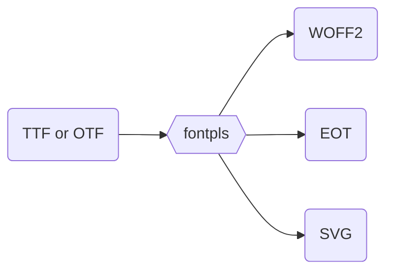

# `fontpls`

A typeface conversion tool for making webfonts, accessible via most CLIs


## Installation
You can install fontpls globally though npm.

```
npm -g i fontpls
```

## Usage

```
fontpls /path/to/file.otf
```

The above command should be run in the CLI. The input (`$1`) value must be a single `.otf` or `.ttf` file. Extra included files will be ignored.


If successful, the new font files (`.svg`, `.eot`, `.woff2`) will be written to the same directory that the original TrueType or OpenType font was in.
